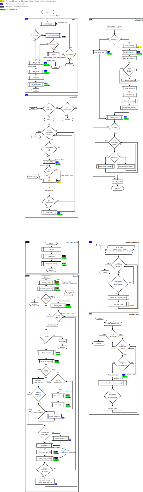

.. _scans_api:

Full API documentation for scans
================================

:mod:`scans.scan` module
-----------------------------------

.. automodule:: artiq_scan_framework.scans.scan
    :members:
    :special-members:
    :private-members:
    :exclude-members: MetaScan
    :undoc-members:

:mod:`scans.extensions` module
-----------------------------------

.. automodule:: artiq_scan_framework.scans.extensions
    :members:
    :special-members:
    :private-members:
    :undoc-members:

:mod:`scans.loading_interface` module
--------------------------------------

.. automodule:: artiq_scan_framework.scans.loading_interface
    :members:
    :special-members:
    :private-members:
    :undoc-members:

Scan Architecture
--------------------
To determine detailed information such as if and when a callback is executed and the major components of a scan and when
they are executed, please refer to the scan architecture documented by the flowchart below.

